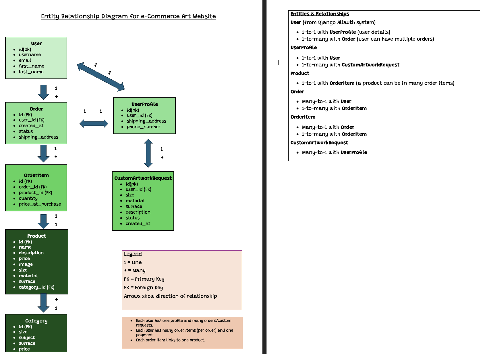
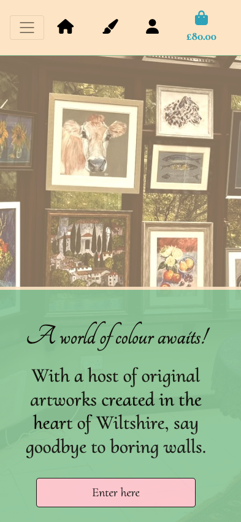
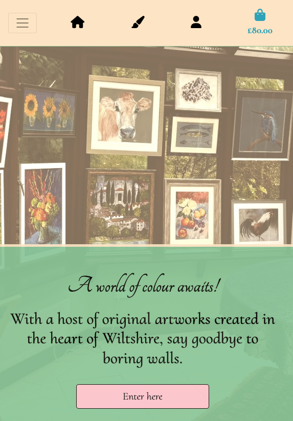
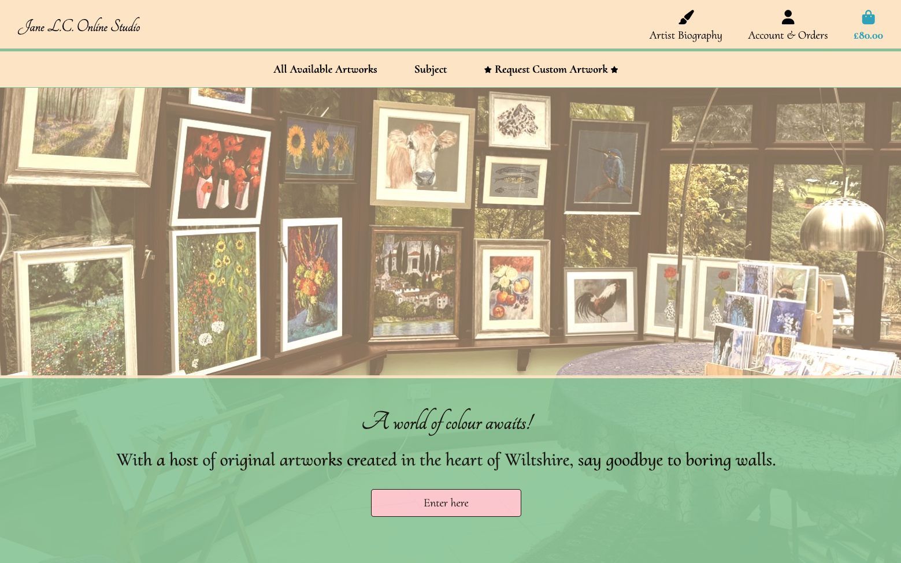
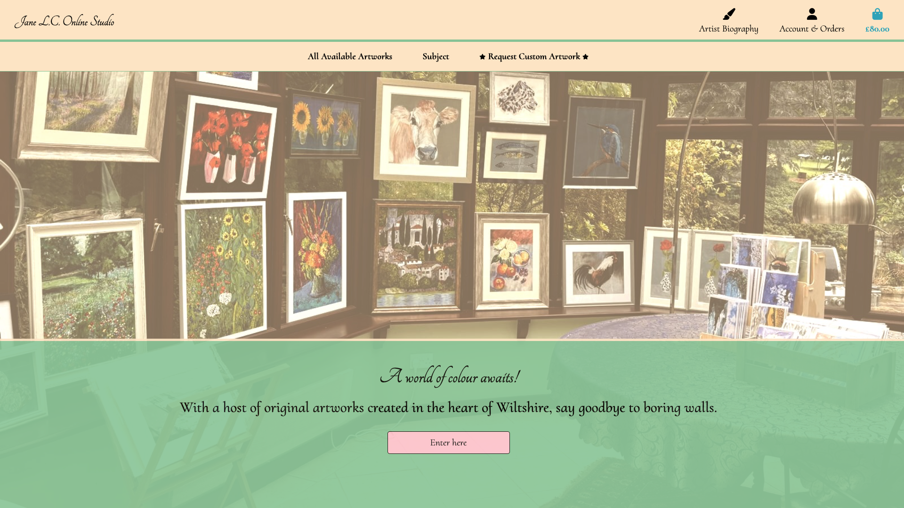

# Milestone-4-Project
# An e-commerce website for an artist and their services. 


(via https://websitemockupgenerator.com/) 

# Jane L.C Online Studio

## URL: https://milestone-4-9edac19c3460.herokuapp.com

# Table of contents
## 1. [Project Overview](#project-overview)
## 2. [User Stories](#user-stories)
### 1. [Must Haves](#must-haves)
### 2. [Should Haves](#should-haves)
### 3. [Could Haves](#could-haves)
## 3. [UX Design](#ux-design)
## 4. [UI Design](#ui-design)
## 5. [Deployment](#deployment)
### 1. [Live Site Link](#live-site-link)
### 2. [Technologies and Platforms Used](#technologies-and-platforms-used)
### 3. [Deployment Steps](#deployment-steps)
## 6. [Testing](#testing)
### 1. [Manual Testing](#manual-testing)
### 2. [Coding Validation](#coding-validation)
### 3. [Bugs Found and Resolved](#bugs-found-and-resolved)
### 4. [Responsiveness Screenshots](#responsiveness-screenshots)
## 7. [Security Considerations](#security-considerations)
## 8. [Next Step Features](#next-step-features)
## 9. [Coding Sources](#coding-sources)
## 10. [Media sources](#media-sources)
## 11. [Acknowledgements](#acknowledgements)
__________________
__________________

## 1. Project Overview

A responsive e-commerce website for an artist to showcase and sell their artwork and services online. The site allows users to browse available artworks, filter by categories, add items to a shopping cart, make custom artwork requests and complete purchases through a secure checkout process. The site also includes user registration and authentication, order management (viewing for users and superusers), and an admin portal for managing products and orders.

The superuser (the artist/website owner) is able to add, edit, and delete products, view all orders, and manage user accounts through the Django admin interface.

### Features

- User registration and authentication
- Artwork listing with filtering options
- Shopping cart and checkout process
- Email confirmation for orders
- View (user and superuser(owner)), edit(superuser), and cancel orders(superuser)
- Responsive design for all devices
- Biography page about the artist
- Admin portal for managing products, orders and requests.


## Criteria provided by Code Institute 
 
### External user’s goal: 
* The user would like to be able to view and purchase artworks from the artist online.

### Site owner's goal:
* The site owner would like the artist to be able to showcase and sell their artworks and services online, manage orders and products easily, and provide a seamless shopping experience for users.

## 2. User stories
* As a user, I want to be able to find out information about the artist, including their biography and available artworks.
* As a user, I want to be able to view available artworks, filter them by categories (e.g., price, subject, size), and see details for each artwork.
* As a user, I want to be able to add artworks to a shopping cart and proceed to checkout. Orders should be linked to my user account.
* As a user, I want the website to be simply presented and easily navigable.
* As a user, I want to be able to register and log-in to the website.
* As a user, I want to be able to make a custom artwork request online, providing extra information in a notes section if necessary.

### Must-haves
* User friendly navigation.
* User should be able to view available artworks and their details.
* User should be able to add artworks to a shopping cart and complete a secure checkout process.
* User should be able to register and log-in to the website.
* User should be able to make a custom artwork request online.
* Superuser (site owner) should be able to add, edit, and delete products (via Django admin).

### Should-haves
* User should be able to filter artworks by categories (e.g., price, subject, size).
* User should be able to view their order history.
* User should recieve an email confirmation following a successful order.


### Could-haves
* User could be able to edit or cancel their orders.
* Superuser could add and edit products via a custom admin panel on the site (not just via Django admin).
* User could view a separate gallery of artwork images.

## 3. UX Design

### Strategy
The aim of the project is to create a functional user registration and e-commerce store using Django and Python, with front-end design from HTML, CSS and JS. 

The user will be able to navigate the website using a navbar at the top of the page. The site will be responsive and easy to use on mobile, tablet and desktop devices.

### Scope
The project will consist of seven main pages (Home, Products, Biography, Custom Artwork Request, Profile, Checkout and Bag) as well as interim success/login pages.  

1. Homepage - Loading the page will bring the user to https://milestone-4-9edac19c3460.herokuapp.com/.  A navbar at the top of the page will allow the user to navigate to other templates and apps within the project.
2. Products - This page will show all available artworks for sale. Each artwork will have an image, title, price and short description. The user can click on an artwork to view more details.
3. Artist Biography - This page will provide information about the artist, including their background, artistic style, and contact information.
4. Custom Artwork Request - This page will include a form for users to submit custom artwork requests. The form will include fields for the user's name, email, artwork description, and any additional notes.
5. Profile - This page will allow users to view their order history and manage their account details.
6. Checkout - This page will allow users to review their shopping cart, enter shipping and payment information, and complete their purchase.
7. Bag - This page will show the user's shopping cart, including the artworks they have added, quantities, and total price. Users can update quantities or remove items from their cart.

#### Additional/Interim pages for functionality

4. Sign Up - This page includes input areas for username, password and password confirmation. This page includes the rules provided by django.allauth regarding username and password appropriateness. 
5. Sign-in - A simple page through which a user can sign in using their credentials. If they are not already registered, there is a link to register. 
6. Order Success - A simple interim page following a successful order which links the user back to the home page or to their profile to view their order history.


Once created, orders and custom artwork requests can be viewed and amended via /admin through the use of a superuser log-in. Registered user details can also be viewed within the /admin portal. The order model includes fields for user, order date, order total, and order items. The custom artwork request model includes fields for user, request date, artwork description, and additional notes.

All orders and custom artwork requests can be viewed by the superuser in the /profile page when they are logged in with their site-owner/superuser credentials.

The superuser can add, edit, and delete products via the Django admin interface as well as mark them as sold/unsold. A sold product will not appear on the products page for users to view or purchase.

### Admin Order View

ADD SCREENSHOTS OF ADMIN PANELS

### Structure
(See wireframes section below)

### Skeleton
The user will navigate by clicking the links in the navbar menu (visible in tablet view and on desktop, collapsed on mobile devices). Main links are set to icons in mobile view.  Templates are linked sitewide by extending the base template. 

### Entity Relationship Diagram (ERD)

This project is hosted on Heroku and the database used is Heroku PostgreSQL.


Four main models, apart from the Django User model, were created for this project: Orders, Products, CustomArtworkRequest, and UserProfile.

The following diagram represents the database structure for the e-commerce website:



### Users (Django's built-in)
* id (PK)
* username
* email
* password
* ...

### Products
* id (PK)
* name
* description
* price
* image (URL)
* created_at
* updated_at    
* is_sold (Boolean)

### Orders
* id (PK)
* user (FK → Users)
* order_date
* total_amount
* status
* created_at
* updated_at

### OrderItems
* id (PK)
* order (FK → Orders)
* product (FK → Products)
* quantity
* price

### CustomArtworkRequest
* id (PK)
* user (FK → Users)
* request_date
* artwork_description
* additional_notes

### Relationships

### User > CustomArtworkRequest

* A User can make many CustomArtworkRequests
* Each CustomArtworkRequest belongs to one User

### Products > OrderItems

* Each Product can appear in at most one OrderItem (or OrderLineItem), since each product is unique and can only be sold once.
* Each OrderItem refers to one Product.

### Orders > OrderItems
* An Order can have many OrderItems.
* Each OrderItem belongs to one Order.

### Users > UserProfile

* Each User has one UserProfile (one-to-one relationship).
* Each UserProfile belongs to one User.


## 4. UI Design
### Surface
My aim was to keep the font decorative but readable. I wanted to ensure the website felt tasteful and refined. The lettering is clear against the light background. The colours across the pages were chosen to be soft and inviting, with a bisque and light olive green to create a warm and welcoming atmosphere.

The text of the site will be black #000000 against the contrasting background of light olive green and bisque to allow for readability.


(https://imagecolorpicker.com/ used to create palettes)

#### Accessibility considerations
* Buttons have hover functionality to assist their visual profile. 
* Aria labels for external links (social media links in footer)
* Contrasting font and background choices

#### Fonts
Primary font -  


Secondary font - 


The two fonts had similarities in style and were both bold and readable. '"Tangerine", cursive' was used only for the logo in the navbar. '"Cormorant Upright", serif' was used for the remainder of the site to ensure maximum readbility while maintaining a consistent, elegant style.


## Initital design wireframes created using Balsamiq

Homepage (/home)


Menu and Reviews (/menu)


Booking (/reservations)

---
## 5. Deployment

## Deployment Steps 

1. Clone the repository:
   ```bash
   git clone https://github.com/TLC-1990/Milestone-3-Project/
   cd milestone-3
   ```
2. Set Up Environment Variables

   Create an env.py file or set environment variables for SECRET_KEY, database credentials, and any third-party API keys.
   On Heroku, add these variables via the dashboard under Settings > Config Vars.
3. Install dependencies:
   ```bash
   pip install -r requirements.txt
   ```
4. Run migrations:
   ```bash
   python manage.py migrate
   ```
   * On Heroku, use:
   ```bash
   heroku run python manage.py migrate
   ```
5. Collect static files:
   ```bash
   python manage.py collectstatic
   ```
   * Whitenoise will serve static files in production.
6. Configure Allowed Hosts:
   In settings.py, set ALLOWED_HOSTS to include your Heroku app domain and any local domains.
7. Set Debug Mode: 
   Ensure DEBUG = False in production for security.
8. Prepare Procfile:
   Ensure your Procfile is present and contains:
   web: gunicorn my_project.wsgi
9. Deploy to Heroku:
   * Push your code to Heroku using Git.
   * Add necessary Heroku add-ons (e.g., Heroku Postgres for the database).
10. Check Logs: 
   For troubleshooting, use:
   heroku logs --tail
11. Update Requirements:
   Keep requirements.txt up to date with all dependencies.
12. Use .gitignore:
   Ensure .gitignore includes sensitive files (e.g., env.py, db.sqlite3) and unnecessary local files.
13. Access the Site:
   Visit your Heroku app URL to view the deployed site.
  HTTPS://milestone-3-ede96df867cb.herokuapp.com/home/ 

---

## Deployment Process (further notes)

#### Project was deployed using GitHub, Visual Studio Code and Heroku.

1. Project was created in Visual Studio Code with a local folder. This was then linked to a Git repository and a first commit was pushed to link the two. The site was deloyed on Github. 

2. A new Heroku project was created and linked to the GitHub repository. This handled deployments throughout the project. 

3. PostgreSQL was used as a database (using the CLI database maker provided by Code Institute) for the final project and this was employed in Heroku dynos and in maintained in the VSCode settings through the env.py file. 

4. Throughout the project, a 'project board' was maintained on GitHub to track progress of project tasks and to help orgaise Must Haves, Should Haves and Could Haves. 

5. Regular commits with descriptions of progress were made throughout the project, as were migrations following amendments or additons to the models.

6. Heroku dynos and necessary KEYS were hidden securely within the project files to help prevent intrusion and external attack to the site. 

7. Static files for the project were handled by Whitenoise. 

8. Debug was set to True during development and to False for submission. 


**Live Site:**  
[milestone-3-ede96df867cb.herokuapp.com/home/](https://milestone-3-ede96df867cb.herokuapp.com/home/)

### Technologies Used
- Python 3.x
- Django 4.x
- Bootstrap 5
- Heroku
- Litepicker (JS date picker)
- HTML, CSS
-JavaScript (external library scripts via CDN and custom JS for Litepicker)

## 6. Testing 

Website checked on Safari and on Chrome on desktop and on IOS (Apple mobile). No bugs observed between browsers. 

### Manual Testing

#### Functionality Testing

I tested each feature of the site to ensure it works as intended and challenged possible bugs.

| Feature | Action | Expected Result | Pass/Fail | Notes |
| ------- | ------ | --------------- | --------- | ----- |
| Home page loads | Visit `/home` | Page loads with navbar (collapsed on mobile and smaller screens), hero image and title, restaurant introduction and button to book a table. | ✅ Pass | No notes |
| Follow navbar links | Click `/menu` (sign up and login detailed below)  | Page changes to Menu and Reviews page |  ✅ Pass | Menu loads successfully and is responsive. |
| Sign in | Visit `/accounts/login`. Entered correct and incorrect login details as well as missing details| Validation error was shown during incorrect login process, correct log in details take a user to /home or to `/bookings` depending on the link followed to login | ✅ Pass | No Notes |
| Signup | Visit `accounts/signup`. Entered fully filled form and incorrect login details and then form with missing details (i.e. email) | Validation error was shown with missing details. A fully completed form sends a confirmation email to the given email address. A confirmed email, following an approved acceptance from the user, takes the user back to the sign in page. | ✅ Pass | A user's login details are saved to the database and can be viewed and edited by the superuser. The user's password is protected from view by AllAuth security. |
| Booking a table |Follow `/bookings`. Fill out fields successfully and missing information.| Successful validation and form submission lead to a success page. Unsuccessful validation and form submission bring up validation errors for the user. A successful booking will be logged to the database and the table will no longer be available to book at that time on that date. An unsuccessful booking will not be logged to the database. | ✅ Pass | No notes |
| View bookings | View past and future logged in via `/my-bookings` |If a user has bookings, they should be shown these bookings (both past and future) in stacked tables. Bookings for the future have button links to edit and cancel bookings. | ✅ Pass | Bookings viewable and bookings can be managed by user |
| Edit booking  | Click “Edit" on a future booking | Booking form is shown, prepopulated with original booking details. User can amend date/time/table or add notes. A valid form sumbmission leads back to the `/my-bookings` page. Unsuccessful validation shows the user errors for them to fix. | ✅ Pass | No notes  |
| Cancel booking | Click 'Cancel' on a future booking | A confirmation message is shown to the user, leading to a cancellation confirmation page following approval by the user (UPDATE: bug appeared during final testing (see final resolved bug note below)) | ✅ Pass | Confirmation page links back to the homepage |
| Log out | Following the log out link in navbar whilst logged in | User is logged out and is returned to `/home` | ✅ Pass | No notes |
| Booking an already booked table | Booking a specific table at a time and date on which it is already booked | User friendly validation error shown on `/edit-booking` page. Validation error shown on `/bookings` however it is not as user friendly. | ⚠️ Partial | Given more time the validation errors would be consistent |

---

### Responsiveness Testing

Tested the site across multiple screen sizes using Chrome DevTools, Apple and Android devices and Windows laptops.

| Device             | Expected Behaviour                              | Pass/Fail |
| ------------------ | ----------------------------------------------- | --------- |
| Mobile (iPhone 14 Pro, Samsung Galaxy S23, iPhone 15 plus) | Navbar collapsed automatically, text readable and clear  | ✅ Pass    |
| Tablet (iPad)      | Navbar links clear, site clear, and booking form clear and useable | ✅ Pass    |
| Desktop (1080p)    | Full layout visible, site responsive to browswer window size changes    | ✅ Pass    |

---

### Responsiveness Screenshots
#### Home Page (`/home`)
Mobile view (small screen)

Tablet view (medium screen)

Laptop view (large screen)

Desktop view (xl screen)


#### Menu Page (`/menu`)
Mobile view (small screen)

Tablet view (medium screen)

Laptop view (large screen)

Desktop view (xl screen)


#### Booking Page (`/bookings`)
Mobile view (small screen)

Tablet view (medium screen)

Laptop view (large screen)

Desktop view (xl screen)


#### My Bookings Page (`/my-bookings`)
Mobile view (small screen)

Tablet view (medium screen)

Laptop view (large screen)

Desktop view (xl screen)


#### Edit Booking Page (`/my-bookings/<pk>/edit/`)
(Same layout as booking page but prepopulated with existing booking details)

#### Confirm Cancel Booking Page (`/my-bookings/<pk>/cancel/`)
Mobile view (small screen)

Tablet view (medium screen)

Laptop view (large screen)

Desktop view (xl screen)


### Accessibility Testing

Used [WAVE](https://wave.webaim.org/) and Lighthouse accessibility checker.

#### Changes made following Wave assessement 

* <H...></H...> tags amended for consecutive consistency.
* Underlined text amended to italic to avoid confusion with links. 

| Check               | Expected Result                             | Pass/Fail |
| ------------------- | ------------------------------------------- | --------- |
| Alt text on images  | All images have alt attributes              | ✅ Pass    |
| Contrast ratio      | Text has sufficient contrast                | ✅ Pass    |
| Keyboard navigation | All interactive elements accessible via Tab | ✅ Pass    |
| ARIA labels on all external links and any links that are ambiguous | Checked and added where missing    | ✅ Pass    |

### Lighthouse scores

Homepage (`/home`)

Mobile scores

 
Desktop scores


#### Issues
* Image is .webp and needs reformatting as .png to improve loading. 
* Hero image causes slowing
* Third-party scripts such as Bootstrap in base.html


Menu (`/menu`)

Mobile scores


Desktop scores


Booking (`/bookings`)

Mobile scores


Desktop scores


#### Issues
* Large layout shifts cause slowing between main section and footer. 
* Third-party scripts such as Bootstrap in base.html

View Bookings (`my-bookings`)

Mobile scores


Desktop scores


Edit/Cancel Bookings (`/my-bookings/<pk>/edit/`)

Mobile scores

Desktop scores


### Bugs Found and Resolved
1) pk error when trying to open booking page. Resolved by using "<int:pk>/", preventing the system from trying to render ...reservations/reservation. (https://www.geeksforgeeks.org/python/django-url-patterns-python/) - further updated to simply use `/bookings` once fixes had been made with booking system.

2) Use of dj-reservation was preventing table booking. Incorrect Django model use was causing a conflict in logic and was preventing validation and saving of bookings. Removal of incorrect Django module allowed saving of booking successfully. 

3) Introduction of postgreSQL database during development caused an issue with migrations. Previous migrations were deleted except for 0001_initial.py. New migrations were made after tables were readdded to the database in the admin panel.

4) Replaced django datepicker, which required a static JS file and caused issues with Bootstrap CMD loading, with Litepicker. (https://www.npmjs.com/package/litepicker)

5) 'available_amount' caused a large bug in the booking form page. Django-booking required this value, although it didn't fit my needs for the project. Amount and num_people were used in its place and "available_amount = forms.IntegerField(widget=forms.HiddenInput(), required=False)" was used to help parse it without it cusing the page to crash or showing up as a necessary area on the booking page by turning it into a hidden form field. 'available_amount' is therefore not saved to the database.

6) Separated 'date' and 'time' after the realisation that both were being logged together. This was causing a bug during the editing of upcoming bookings and was preventing the form from being prepopulated with the chosen date. Separating these into time/time_slot and date using datetime from Django allowed both to be logged separately and the form to validate correctly as well as allowing the user to view all initial details. 

7) Booking an already booked table caused a a 500 error and for the page to crash. Resolved by amending the booking form validation to check for existing bookings and raise a ValidationError if the table is already booked at that time on that date.

8) Adding postgreSQL caused an issue with Heroku deployment due to missing dependencies. Resolved by deleting old migrations and remaking them after adding postgreSQL to the local environment.

9) Added POST method (within confirmation button on booking_cancel.html) to cancel booking view to resolve issue with form not submitting changes.

### CSS, HTML, Python and JS Validation

###  CSS validation
(W3C CSS validation service
(https://jigsaw.w3.org/css-validator/) used for CSS validation.)


### HTML validation

W3C Markup Validation Service 
(https://validator.w3.org/) used for HTML validation

### `/home`


### `/menu`


### `/bookings`


### `/my-bookings`


### `/my-bookings/<pk>/edit/`


### `/my-bookings/<pk>/cancel/`


Steps taken to resolve errors:
* Extra closing tags removed
* Tags fixed in footer
* Main attribute converted to div to prevent multiple main tags on a page
* Trailing slashes removed from booking/edit templates

### Python validation
Pep8 validation (https://www.codewof.co.nz/style/python3/ and https://www.minifier.org/python-beautifier used to locate and resolve issues)

### Booking_system_app
admin.py 


apps.py


forms.py


models.py


urls.py


views.py


### Main Project Folder

settings.py


urls.py


wsgi.py


### User_Bookings
apps.py


urls.py


views.py


### Steps taken to resolve errors:
* Lines shortened to under 79 characters, where possible without breaking code logic
* Added necessary imports
* Removed unused variables and imports
* Fixed indentation issues
* Fixed missing blank lines at end of files
* Fixed missing two blank lines between classes and functions
* Fixed missing spaces after commas and around operators
* Fixed docstrings where missing

### JavaScript Validation
JSLint (https://jslint.com/) used for JS validation

Validation of custom JS code for Litepicker datepicker used on booking form page (/bookings) and edit booking page (/my-bookings/<pk>/edit/) revealed no issues other than single quotes being used instead of double quotes. Edited to use double quotes for consistency.

## 7. Security Considerations
* SECRET_KEY and other sensitive information stored in env.py file, not in main settings.py file.
* Debug set to False for production deployment.
* Used Django's built-in authentication system for user registration and login. Users passwords are hashed and securely stored.
* Used HTTPS for secure communication (handled by Heroku).
* Validated and sanitized user inputs in forms to prevent SQL injection and XSS attacks.
* Used Django's CSRF protection for forms.

### Reflections on Security Issues Encountered
* Mistakenly committed creds.json to GitHub early in development. Removed file and regenerated credentials to ensure security.
* Mistakenly missed adding db.sqlite3 to .gitignore early in development. Removed file from GitHub and added to .gitignore to ensure security. Although the project uses PostgreSQL in production, this was important to maintain best practices.

I will ensure to always double-check files before committing to GitHub in future projects to prevent similar issues.

## 8. Next Step Features	

Having a messaging option would have been helpful, so that customers could have their queries answered either by an AI chat service or, ideally, by a member of staff at the restaurant. 

Sending the bookings to GoogleSheets or GoogleCalendar for staff at the restaurant to view bookings would have been useful. 

I would have liked to add photos of the food to the menu items, so users would be more engaged and keen to make a booking. 

If the restaurant had multiple locations, I would have liked to add a location choice to the booking form.


## 9. Coding Sources
* Code taken from Bootstrap v5.0 and heavily adapted/edited to fit needs of site (NavBar, buttons)
* Code Institute lessons - "Love To Blog" and "Boutique Ado" python/django code along lessons as well as prior modules.
* Balsamiq was used to create wireframes
* Responsive Viewer Chrome add-on was used for responsiveness screenshots

Django for Beginners (version 2.1) - Templates, Class-based views and URLS (Chapter 3), registration, log-in and authentication (Chapter 7) (available online - https://elhacker.info/manuales/Lenguajes%20de%20Programacion/Python/Django%20for%20Beginners_%20Build%20Websites%20with%20Django%20(Version%202.1).pdf)

https://docs.djangoproject.com/en/5.2/topics/db/models/  and https://www.w3schools.com/django/django_models.php - creating models in django

https://dj-booking.readthedocs.io/en/latest/ and https://pypi.org/project/dj-booking/ - dj-booking documentation for setup.

https://stackoverflow.com/questions/64225732/how-to-get-time-slot-in-django-for-doctor-appointment - creating timeslot lists in django

https://stackoverflow.com/questions/68776480/django-store-actual-availability-and-query-the-available-schedule-for-new-bookin - cascading time slots and days of the week for booking form 

https://stackoverflow.com/questions/3367091/whats-the-cleanest-simplest-to-get-running-datepicker-in-django - inserting django datepicker plus to replace days of the week

https://docs.djangoproject.com/en/5.2/ref/forms/validation/ - clean data validation logic using super()

https://docs.djangoproject.com/en/5.2/ref/validators/ - raising validator errors in Django to prevent overbooking

https://realpython.com/python-getter-setter/ - Using @property setter to maintain ‘Number of People’ rather than amount in booking form. 

https://docs.djangoproject.com/en/5.2/topics/forms/modelforms/ and https://www.djangotricks.com/tricks/Swv44PDSrJYQ - Overriding the save method of the model form to allow ‘num_people’

https://stackoverflow.com/questions/9578906/easiest-way-to-combine-date-and-time-strings-to-single-datetime-object-using-pyt/9579030 - creating a single datetime element in forms.py  

https://www.devhandbook.com/django/templates/ - understanding html templates in django

https://stackoverflow.com/questions/14400035/how-to-return-a-static-html-file-as-a-response-in-django - linking and returning static html files in Django

https://stackoverflow.com/questions/74339432/attempting-to-read-pk-from-url-in-django-but-getting-error-noreversematch-at - url pk error explanation and resolution 

https://sendlayer.com/blog/how-to-send-email-with-django and https://mailtrap.io/blog/django-send-email/ - code and settings to send confirmation emails following booking


VSCode Co-Pilot was consulted to assist in migration errors and issues faced with creds.json and github. Assistance sought early on to configure STATIC settings and later to assist with implimentation of Whitenoise and amending of links within templates so they may be readable.

OpenAI consulted to assist with basic html template creation, then heavily adapted to suit project. Consulted for assistance in creating migrations to input table groups (5 indoors/5 outdoors) and creating dummy slot. Suggestions implimented to resolve 'available_amount' issue caused by djbooking system causing a pk error.  

## 10. Media Sources
<table>
  <caption>
    Images used within site
  </caption>
  <thead>
    <tr>
      <th scope="col">Photo Title</th>
      <th scope="col"> Relative Path </th>
      <th scope="col">Source Link</th>
      <th scope="col">Page Location</th>
    </tr>
  </thead>
  <tbody>
    <tr>
      <th scope="row">hotdog-hero.png</th>
      <td>static/css/images/hotdog-hero.png</td>
      <td>https://images.pexels.com/photos/4518645/pexels-photo-4518645.jpeg?cs=srgb&dl=pexels-polina-tankilevitch-4518645.jpg&fm=jpg&_gl=1*uhos97*_ga*MTEwMDczMDU5NS4xNzU0MzAzNzI3*_ga_8JE65Q40S6*czE3NTQzMDM3MjYkbzEkZzEkdDE3NTQzMDM5NTckajU5JGwwJGgw</td>
      <td>/home</td>
    </tr>
     <tr>
      <th scope="row">pexels-godisable-jacob-226636-718978.webp</th>
      <td>booking_system_app/static/booking_system_app/pexels-godisable-jacob-226636-718978.webp</td>
      <td>https://images.pexels.com/photos/718978/pexels-photo-718978.jpeg?cs=srgb&dl=pexels-godisable-jacob-226636-718978.jpg&fm=jpg&_gl=1*5ndtqf*_ga*MTM0NDkxODYyMy4xNzU0NDA2NDMw*_ga_8JE65Q40S6*czE3NTQ0MDY0MjkkbzEkZzEkdDE3NTQ0MDY0NDckajQyJGwwJGgw</td>
      <td>/menu</td>
    </tr>
    <tr>
      <th scope="row">pexels-olly-788567.webp</th>
      <td>booking_system_app/static/booking_system_app/pexels-olly-788567.webp</td>
      <td>https://images.pexels.com/photos/788567/pexels-photo-788567.jpeg?cs=srgb&dl=pexels-olly-788567.jpg&fm=jpg&_gl=1*1957m2y*_ga*MTM0NDkxODYyMy4xNzU0NDA2NDMw*_ga_8JE65Q40S6*czE3NTQ0MDY0MjkkbzEkZzEkdDE3NTQ0MDY0NDckajQyJGwwJGgw</td>
      <td>/menu</td>
    </tr>
     <tr>
      <th scope="row">pexels-olly-846741.webp</th>
      <td>booking_system_app/static/booking_system_app/pexels-olly-846741.webp</td>
      <td>https://images.pexels.com/photos/846741/pexels-photo-846741.jpeg?cs=srgb&dl=pexels-olly-846741.jpg&fm=jpg&_gl=1*5vso3t*_ga*MTM0NDkxODYyMy4xNzU0NDA2NDMw*_ga_8JE65Q40S6*czE3NTQ0MDY0MjkkbzEkZzEkdDE3NTQ0MDY0NDckajQyJGwwJGgw</td>
      <td>/menu</td>
    </tr>
  </tbody>
</table>

## Reflection on project

This project has been a steep learning curve but I have enjoyed the challenge of creating a functional booking system using Django and Python. 

Taking my time, reading the documentation and seeking help when needed has helped me to overcome the various (sometimes multiple!) issues I have faced.  

This has helped me feel more confident in my coding ability, and in being able to recognise and resolve bugs. Overall , I am pleased with the end result and feel that I have created a functional, user-friendly website that meets the initial project goals.

## 11. Acknowledgements 
* Dr Raghav Kovvuri (HE Lecturer- Computing at University Centre of Peterborough) for support and advice and understanding throughout the course. 
* Iuliia Konovalova, my wonderful, knowledgeable mentor. Thank you for trying to help stop my panic. 
* My family and friends for their patience and support throughout the course and for the steady supply of black coffee, sweets and the odd shoulder to cry on!